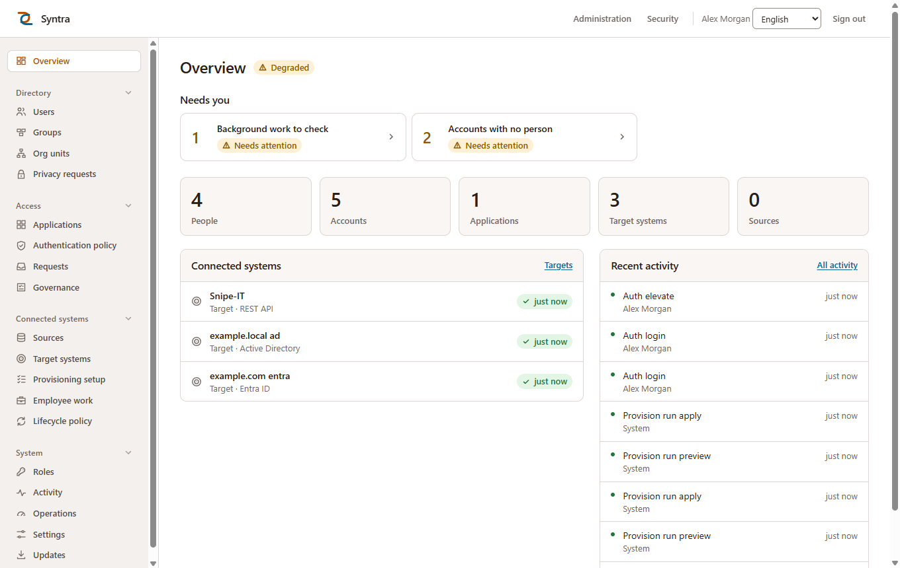

# Syntra

Open-source Identity and Access Management. One place to hold an
organisation's people, decide what they may reach, and give them a single
front door to every application they use.

Self-hosted · multi-tenant · Apache-2.0



## What it does

**For employees** — one sign-in and a portal of tiles, one per application they
have been given. Second factors (authenticator app, security key, recovery
codes), self-service password reset, and access requests with approvals.

**For administrators** — a console that opens on what needs a person, and:

| Area | What you get |
|---|---|
| **Directory** | People, contracts and accounts kept apart (a person is not a login), groups, an org-unit tree, CSV import, service accounts, and a privacy-request workflow |
| **Access** | SAML 2.0 and OpenID Connect identity provider, an application catalog (Slack, Google Workspace, Salesforce, Zoom, GitLab, Grafana, AWS IAM Identity Center, Nextcloud, Snipe-IT), assignment by person, group or org unit, an ordered authentication policy, and upstream federation to another SAML or OIDC provider |
| **Sources** | Directory sync from LDAP or Active Directory, an HR feed read over SFTP, and inbound SCIM 2.0 — every run previewed as a reviewable diff before anything changes |
| **Provisioning** | Accounts created, updated and disabled in Active Directory, Microsoft Entra ID, any SCIM 2.0 service or any REST API described by a connector document, driven by business rules and org units, guarded by thresholds, held for approval where it matters |
| **Lifecycle** | Joiners, movers and leavers tracked as employee work until every target confirms, with service levels and second-approval rules |
| **Govern** | Reconciliation, segregation of duties, recertification campaigns and a tamper-evident evidence chain |
| **Operate** | A tamper-evident audit log, incidents you can acknowledge and resolve, background-work health with safe repairs, emergency write stops, break-glass access, backups that verify themselves, and updates installed from the console |

See every screen in the **[console guide](docs/console-guide.md)**.

## Documentation

| Guide | For |
|---|---|
| [Console guide](docs/console-guide.md) | Every console screen, with screenshots, in the order you would set one up |
| [Install](docs/install.md) | Development install, the container path, TLS, Kubernetes, the single-process release layout |
| [Configure](docs/configure.md) | Every setting, tenants and hostnames, sources, connectors, sign-in and policy, SSO and federation, the administration API |
| [Operate](docs/operate.md) | Updates, backups, monitoring, incidents, troubleshooting, and the runbooks |

## Quickstart (development)

Requires Node 22+ and Docker; `corepack enable` picks up the pinned pnpm.

```bash
pnpm install
pnpm db:up
cp .env.example .env && cp packages/db/.env.example packages/db/.env
node -e "console.log(require('crypto').randomBytes(32).toString('base64'))"  # twice: SESSION_SECRET and MASTER_KEY in .env
pnpm db:generate && pnpm db:migrate
SEED_ADMIN_PASSWORD='choose-a-long-one' pnpm seed
pnpm dev                                    # api on :3000, web on :5173
```

Open **http://acme.localhost:5173**, sign in as `admin`, and choose
**Administration**. For a real installation — containers behind TLS, or the
release layout with updates from the console — follow [Install](docs/install.md).

## How it is put together

```
apps/
  api/          Fastify: the REST API, SAML and OIDC endpoints, federation
  web/          One React application: the portal at /, the console at /admin
packages/
  db/           Prisma schema and migrations
  core/         Domain services; knows nothing about HTTP
  contracts/    Zod schemas shared by the API and the web app
  connectors/   LDAP/AD, Entra ID, SCIM, REST and SFTP clients
  protocols/    SAML, WS-Federation, OIDC and XML signing
  ui/           The design system
```

Three decisions shape everything else:

- **Tenant isolation is enforced by PostgreSQL.** Every tenant table has
  `FORCE ROW LEVEL SECURITY` and the application connects as a role that
  cannot bypass it, so a query that forgets its tenant returns nothing rather
  than another tenant's rows.
- **A person is not an account.** `Person` is who someone is, `Contract` is
  what they do, `User` is how they sign in — so a contractor with two
  engagements, a mover and a service account with nobody behind it are all
  representable.
- **Every authentication goes through one function.** Sign-in, elevation to
  the console and every application launch reach the same `authorize()`, so
  policy and auditing live in one place.

## Tests

```bash
pnpm test                       # domain, API and database integration tests
pnpm --filter @syntra/web test  # console component tests
pnpm e2e                        # browser tests against a running stack
pnpm typecheck
```

The integration tests run against a real PostgreSQL: row-level security,
partial unique indexes and append-only rules only exist in the database. More
in [Operate](docs/operate.md).

## License

Apache-2.0. See [LICENSE](LICENSE).
