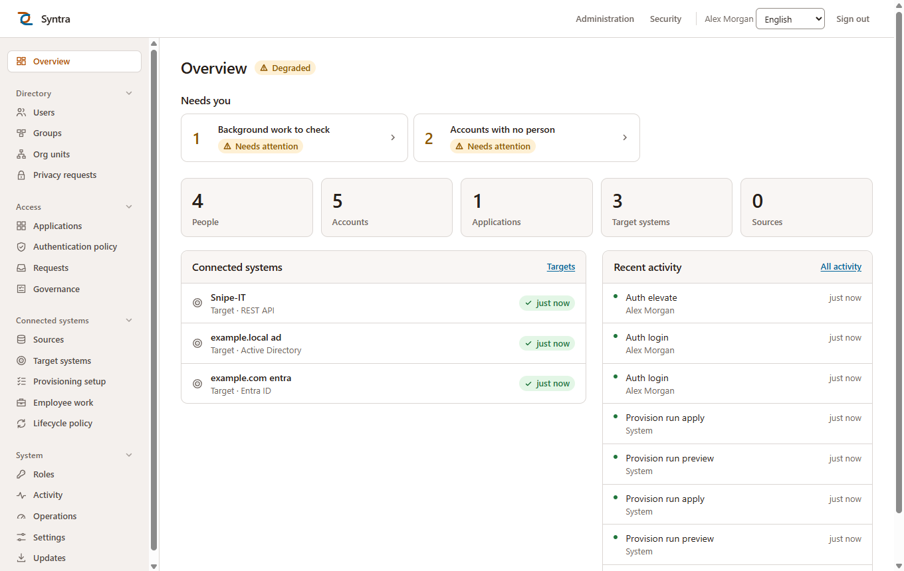
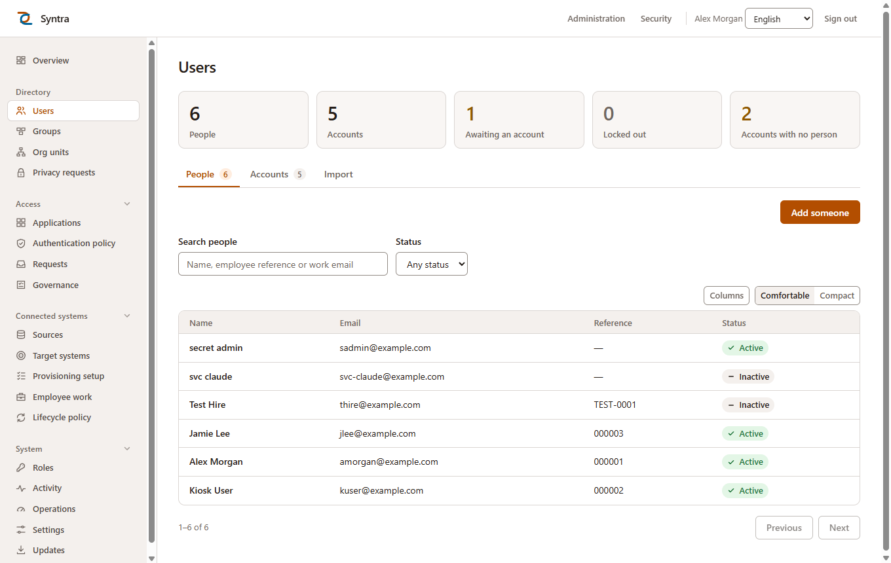
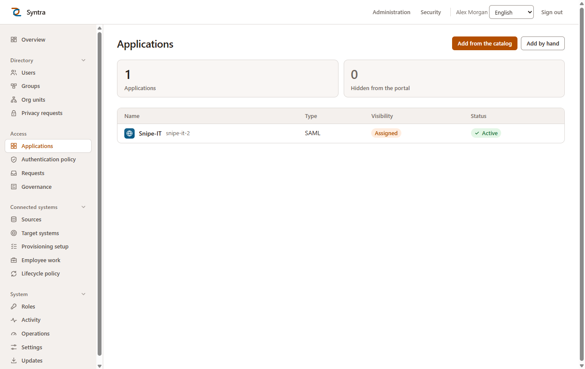
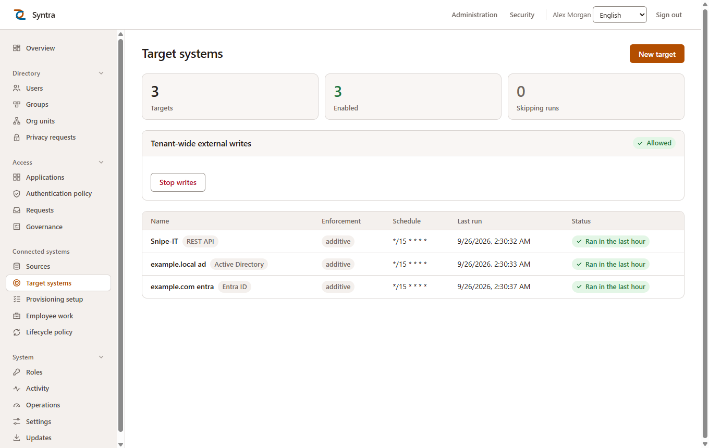
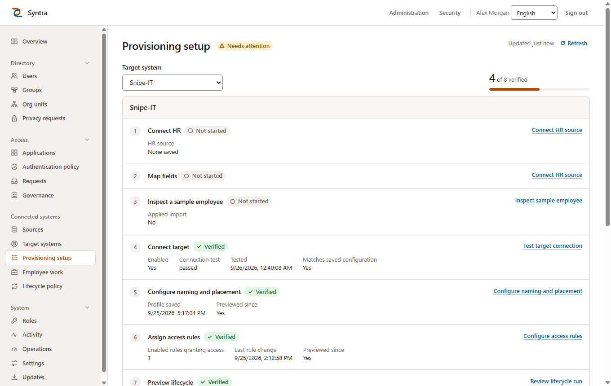

<p align="center">
  <picture>
    <source media="(prefers-color-scheme: dark)" srcset="docs/assets/syntra-logo-dark.svg">
    
  </picture>
</p>

<p align="center">
  <strong>Free, self-hosted identity and access management: single sign-on, provisioning, lifecycle and access reviews in one install.</strong>
</p>

<p align="center">
  <a href="https://github.com/ssan9876/syntra/actions/workflows/ci.yml"></a>
  <a href="https://github.com/ssan9876/syntra/releases/latest"></a>
  <a href="LICENSE"></a>
  <a href="https://ssan9876.github.io/syntra/"></a>
</p>

Syntra holds your people, signs them in to applications over SAML 2.0 and
OpenID Connect, and creates, changes and disables their accounts in Active
Directory, Microsoft Entra ID, SCIM 2.0 and REST systems. Apache-2.0, with no
paid edition.



## Quickstart

Requires Docker with Compose.

```bash
git clone https://github.com/ssan9876/syntra.git && cd syntra
scripts/quickstart.sh --domain localhost --email you@example.com
# then open http://localhost:8080
```

On Windows, use `scripts/quickstart.ps1`. A real hostname gets a Let's
Encrypt certificate. Options, TLS and production installs:
[Install → Quickstart](docs/install.md#quickstart).

## Why Syntra

- **Preview before apply.** Every directory sync and provisioning run is a plan
  first: creates, updates, disables, group changes. A run that would change
  more than its safety threshold waits for a person, and so does the first run
  on every target.
- **People are not logins.** A person (who someone is), their contracts (what
  they do) and their accounts (how they sign in) are separate records. A
  contractor with two engagements, a mover, or a service account with nobody
  behind it all fit.
- **Lifecycle that finishes.** Joiners, movers and leavers come from HR
  contracts and stay open as employee work until every target confirms, with
  service levels and second-approval rules.
- **Governance built in.** Access reviews, segregation of duties, orphan
  accounts and a tamper-evident audit log, in the same database as the access
  they describe.

## What it does

| Area | What you get |
|---|---|
| **Sign-in** | SAML 2.0, OpenID Connect and WS-Federation identity provider. Authenticator apps, security keys, recovery codes, self-service password reset. An ordered sign-in policy. Upstream SAML or OIDC federation. |
| **Applications** | A 17-entry catalog (Slack, Google Workspace, Salesforce, Zoom, GitLab, Grafana, AWS IAM Identity Center, Snipe-IT and more), any other SAML or OIDC application by hand, assignment by person, group or org unit. |
| **Directory** | People, contracts and accounts, groups with membership rules, an org-unit tree, CSV import, service accounts, privacy requests. |
| **Sources** | LDAP or Active Directory sync, an HR export over SFTP, inbound SCIM 2.0. Each run is a reviewable diff. |
| **Provisioning** | Active Directory, Microsoft Entra ID, any SCIM 2.0 service, any REST API described by a connector document. Business rules, safety thresholds, **Stop writes**. |
| **Governance** | Access reviews, segregation of duties, reconciliation, a tamper-evident evidence chain. |
| **Operations** | Incidents in the console, background-job health with safe repairs, backups that verify themselves, break-glass access, updates installed from the console. |

What is tested against what: [Compatibility](docs/compatibility.md).

## Screenshots

| | |
|---|---|
|  |  |
| People, kept apart from their accounts | Applications and the catalog |
|  |  |
| Target systems and their runs | A checklist per target, to the first applied run |

Every screen: [Console tour](docs/console-guide.md).

## Documentation

Online at **[ssan9876.github.io/syntra](https://ssan9876.github.io/syntra/)**, or in [`docs/`](docs/):

| Read | For |
|---|---|
| [Install](docs/install.md) | Quickstart, containers, TLS, Kubernetes, the single-process layout |
| [Guides](docs/guides/index.md) | One task each: SSO from the catalog, AD provisioning, Mattermost SAML, access reviews, backups |
| [Configure](docs/configure.md) | Every setting, sources, connectors, SSO, the administration API |
| [Operate](docs/operate.md) | Updates, backups, monitoring, incidents, runbooks |
| [Compatibility](docs/compatibility.md) | Every connector and catalog app, with status and limits |
| [Comparison](docs/comparison.md) | Syntra next to Keycloak, Authentik, Zitadel and midPoint |
| [Roadmap](ROADMAP.md) | What is planned |

## How it is put together

```
apps/api        Fastify: REST API, SAML, OIDC and WS-Federation endpoints
apps/web        One React app: the portal at /, the console at /admin
packages/core   Domain services; knows nothing about HTTP
packages/db     Prisma schema and migrations (PostgreSQL 16)
packages/connectors  LDAP/AD, Entra ID, SCIM, REST and SFTP clients
packages/protocols   SAML, WS-Federation, OIDC and XML signing
```

- **Tenant isolation is enforced by PostgreSQL** row-level security. A query
  that forgets its tenant returns nothing.
- **Every authentication goes through one `authorize()`**: sign-in, console
  elevation and every application launch.

Working on Syntra itself: [development install](docs/install.md#development-install).

## Community

- Questions and ideas: [GitHub Discussions](https://github.com/ssan9876/syntra/discussions)
- Bugs: [issues](https://github.com/ssan9876/syntra/issues)
- Contributing: [CONTRIBUTING.md](CONTRIBUTING.md)
- Security reports: [SECURITY.md](SECURITY.md), not public issues

Syntra is maintained by one person and will stay free.

## License

Apache-2.0. See [LICENSE](LICENSE).
